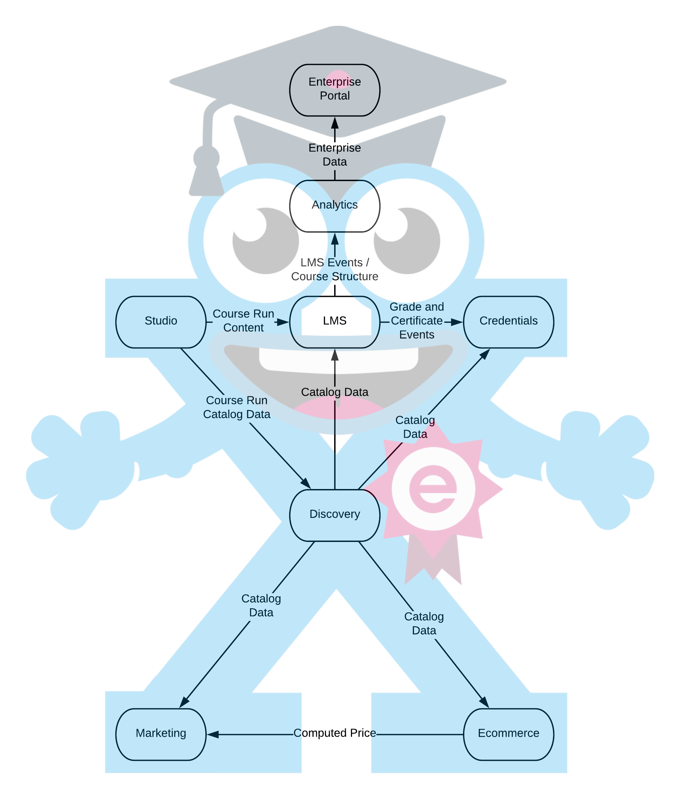

====
Architecture Overview
====

Goals of this Document
--------
The goal of this document is to explain the edX architecture at a system level. It is not comprehensive, but the hope is that this is enough foundational understanding to give you the big picture and give enough context so the rest of the documentation is understandable.  More specifically, this document outlines the roles and responsibilities of each of the major services and demonstrates how data flows through the edX system. 

Welcome to edX Architecture
-----
Hello! Welcome to the edX architectural overview!  
Allow me to introduce Xsy, they are the edX mascot!

Now let's take a look at Xsy's underlying structure:

Major Services and their Roles and Responsibilities
------

=================     =======
 Service              Role                
=================     =======
LMS                   Where learner engages with learning content (ex. videos, discussion forums, reading materials, assesments)
Studio		          Where learning content is authored. (Instructor create course content and structure)
Discovery             Holds catalog of learning content (ex. list of courses, program strucuture, pricing of learning content, marketing data).  We are moving towards this being the single source of truth for meta data around learning content
Marketing             Where learners discover learning content
Ecommerce	          Where learners purchase learning content, refunds are generated, offers created, etc...
Credentials           Holds learner outcomes (ex. certifactes, credits, *etc*...)
Analytics             Where instructors can see how learners are engaging with their course and an aggregate of how learners are performing
Enterprise Portal     **PLACE HOLDER!**
=================     =======

How Data Flows Through Our System
-------
Here are the way that data flows through our system.  This diagram is not complete, here are a few important caveats:

- This is how data *should* flow and how things work generally. For example: the ``discovery`` service is supposed to be the source of truth for all learning content meta data - this is not always how it works in practice, but we are working towards that
- Authorization is not included, it would have made the chart very hard to read **PLACE HOLDER TO EXPLANATION OF AUTH**
- Read Replica is also not included.  Read Replica is what we use to aggreate data from all the services, it would have made the diagram too messy so it wasn't included
- Hyperlinks from one service to another are not included in this diagram.  For example, when a user is in the ``LMS`` or the 

